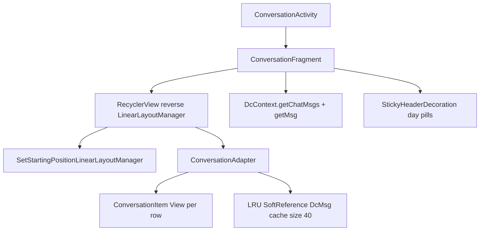

# Chat feed — Delta Chat parity reference

**Do not re-explore the Delta Chat repo for feed architecture.** This document is the frozen reference for how DC 2.52.0 opens and scrolls a chat, what Polli must mirror, and where Compose is allowed to differ.

**Source snapshot:** Polli fork of Delta Chat 2.52.0, legacy Java removed in `af2bdf2f1`. DC classes cited below are recoverable via:

```bash
git show 'af2bdf2f1^:src/main/java/org/thoughtcrime/securesms/<Class>.java'
```

---

## DC exact setup

### Stack (non-negotiable shape)



| Piece | DC class / API | Role |
|-------|----------------|------|
| Activity host | `ConversationActivity` | Intent extras: `CHAT_ID`, `STARTING_POSITION` |
| List host | `ConversationFragment` | Owns `RecyclerView`, scroll FAB, `reloadList()` |
| Layout manager | `SetStartingPositionLinearLayoutManager` | `VERTICAL`, **`reverseLayout = true`**, one-shot open scroll |
| Adapter | `ConversationAdapter` | `int[] dcMsgList` only — **no full message list in memory** |
| Row | `ConversationItem` (+ typed layouts) | **Mutates existing Views** in `bind()` — no reinflation |
| Message load | `DcContext.getMsg(id)` via JNI | LRU cache keyed by **position**, max **40**, `SoftReference` |
| ID list | `DcContext.getChatMsgs(chatId, 0, 0)` | Single sync call on open/reload — returns `int[]` |
| Day labels | `StickyHeaderDecoration` | Headers from `getHeaderId()` / `getSortTimestamp()` — **not separate adapter rows** |
| Fresh/unread | `rpc.getFreshMsgCnt` + `startingPosition = freshMsgs - 1` | Opens at first unread when no explicit start position |

### RecyclerView config (DC)

From `ConversationFragment` + list XML:

- **`reverseLayout = true`** (newest at bottom, index 0 = newest)
- **`setHasStableIds(true)`** — item id = message id (`dcMsgList[length - 1 - position]`)
- **`itemAnimator = null`** (no insert animations)
- **`setItemViewCacheSize(24)`** (off-screen view cache)
- **`clipToPadding = false`**
- **No scroll-state hacks** — no disabling blur, capture, or overlays while dragging

### Open path (DC — exact sequence)

1. Activity creates fragment with `chatId`, `startingPosition` from intent.
2. `initializeListAdapter()`:
   - Create `ConversationAdapter` with `DcChat` + `Recipient`.
   - Attach `AudioPlaybackViewModel`.
   - Add `StickyHeaderDecoration`.
   - `getFreshMsgCnt` → if no `startingPosition`, set `layoutManager.setStartingPosition(freshMsgs - 1)`.
3. **`reloadList()` on main thread:**
   ```java
   int[] msgs = dcContext.getChatMsgs(chatId, 0, 0);
   adapter.changeData(msgs);
   ```
4. `changeData` → `notifyDataSetChanged()` (full refresh; cache cleared).
5. First layout: `SetStartingPositionLinearLayoutManager.onLayoutChildren` applies pending start offset.
6. Visible rows: `onBindViewHolder` → `getMsg(position)` (cache or JNI) → `ConversationItem.bind(...)`.

**Total blocking work on open:** one `getChatMsgs` + layout/bind for ~viewport rows. Per-row `getMsg` only for visible + view-type checks.

### Adapter bind semantics (DC — copy exactly)

**`ConversationAdapter.onBindViewHolder`:**

```java
holder.getItem().bind(
    getMsg(position),   // DcMsg from LRU or dcContext.getMsg
    dcChat,
    glideRequests,
    batchSelected,
    recipient,
    pulseHighlight,
    playbackViewModel,
    audioPlayPauseListener);
```

**`getMsg(position)`:**

- Check LRU at **position** (not msg id).
- On miss: `dcContext.getMsg((int) getItemId(position))` — **direct JNI, no JSON-RPC**.
- Store `SoftReference` in LRU.

**`getItemViewType(i)`:** calls `getMsg(i)` — may hit cache; separate layouts for text / audio / thumbnail / document / sticker / info × in/out (11 types). **View inflation happens once per type in `onCreateViewHolder`, never per bind.**

**`changeData(int[] dcMsgList)`:**

```java
this.dcMsgList = dcMsgList == null ? new int[0] : dcMsgList;
recordCache.clear();
updateLastSeenPosition();
notifyDataSetChanged();
```

**No incremental DiffUtil for normal reloads.** DC accepts full refresh cost because bind is cheap (View mutation).

### Scroll preservation on reload (DC)

When **not** first load, before `changeData`:

```java
oldCount = adapter.getItemCount();
oldIndex = layoutManager.findFirstCompletelyVisibleItemPosition();
firstView = layoutManager.findViewByPosition(oldIndex);
pixelOffset = list.getBottom() - firstView.getBottom() - list.getPaddingBottom();
// after changeData:
newIndex = oldIndex + msgs.length - oldCount;
layoutManager.scrollToPositionWithOffset(newIndex, pixelOffset);
```

Polli equivalent: [`ChatFeedScrollAnchor`](../src/main/java/com/polli/android/chat/ChatFeedScrollAnchor.kt).

### Scroll-to-bottom (DC)

```java
private static final int SCROLL_ANIMATION_THRESHOLD = 50;

void scrollToBottom() {
  if (findFirstVisibleItemPosition() < SCROLL_ANIMATION_THRESHOLD) {
    list.smoothScrollToPosition(0);
  } else {
    list.scrollToPosition(0);
  }
}
```

Polli equivalent: [`ChatRecyclerController.scrollToBottom`](../src/main/java/com/polli/android/chat/ChatRecyclerController.kt).

### Grouping / avatars (DC vs Polli)

**DC does not cluster bubbles by time.** Each row decides `showSender` independently:

```java
showSender = ((dcChat.isMultiUser() || dcChat.isSelfTalk()) && !messageRecord.isOutgoing())
    || messageRecord.getOverrideSenderName() != null;
```

Avatar + name row visible when `showSender`; otherwise hidden. Spacing uses fixed dimens — no 21-minute stack logic.

**Polli addition (keep):** 21-minute grouped stacks via [`MessageStubGrouping`](../polli-domain/src/commonMain/kotlin/com/polli/domain/model/chat/MessageStubGrouping.kt). This is **extra UI logic DC doesn't have** — it must stay **O(n) at feed build**, never per-frame. Cost is negligible if stubs are preloaded; **not a perf excuse**.

### Haze / frosted chrome (Polli-only)

DC has **no feed haze**. Polli adds haze on composer + header via `HazeState`.

**Rule:** Haze must **stay active while scrolling**. DC never toggles visual chrome off during `SCROLL_STATE_DRAGGING`. Disabling `hazeSource` on scroll is a **regression** — ugly and not a valid optimization unless benchmarks prove >5% jank reduction **with** an alternative (e.g. static snapshot blur).

---

## Polli mapping

| DC | Polli | Status |
|----|-------|--------|
| `ConversationFragment` | [`ChatFeedRecycler.kt`](../src/main/java/com/polli/android/chat/ChatFeedRecycler.kt) + [`ChatScreen.kt`](../src/main/java/com/polli/android/chat/ChatScreen.kt) | ✓ RecyclerView host |
| `SetStartingPositionLinearLayoutManager` | [`PolliChatLayoutManager.kt`](../src/main/java/com/polli/android/chat/PolliChatLayoutManager.kt) | ✓ ported |
| `ConversationAdapter` | [`PolliChatFeedAdapter.kt`](../src/main/java/com/polli/android/chat/PolliChatFeedAdapter.kt) | ⚠ Compose rows |
| `ConversationItem.bind` | [`PolliChatFeedRow.kt`](../src/main/java/com/polli/android/chat/PolliChatFeedRow.kt) + [`MessageBubble.kt`](../src/main/java/com/polli/android/chat/MessageBubble.kt) | ⚠ recomposition cost |
| `getChatMsgs` | [`ChatController.bind`](../polli-ui/src/commonMain/kotlin/com/polli/ui/chat/ChatController.kt) → `syncFeedIds` | ✓ **`JniMessageRepository`** (JNI) |
| `getMsg` + LRU 40 | [`JniMessageRepository`](../src/main/java/com/polli/android/data/engine/JniMessageRepository.kt) + [`ChatMessageStore`](../polli-ui/src/commonMain/kotlin/com/polli/ui/chat/ChatMessageStore.kt) | ✓ JNI on bind miss (DC-identical) |
| `reloadList` scroll anchor | [`ChatFeedScrollAnchor`](../src/main/java/com/polli/android/chat/ChatFeedScrollAnchor.kt) | ✓ |
| `scrollToBottom` threshold 50 | [`ChatRecyclerController`](../src/main/java/com/polli/android/chat/ChatRecyclerController.kt) | ✓ |
| Sticky day headers | Inline `FeedItem.DayMarker` rows | Different shape, OK |
| Event-driven updates | [`ChatController`](../polli-ui/src/commonMain/kotlin/com/polli/ui/chat/ChatController.kt) event observer | ✓ incremental paths exist |

---

## Copy EXACTLY in Kotlin Compose

Use this checklist for every perf change. **If it violates DC semantics, it's wrong unless measured and documented.**

### 1. Data model — IDs first, messages lazy

| Rule | DC | Polli must |
|------|-----|------------|
| Feed driven by `int[]` msg ids | ✓ | ✓ `msgIds` in `ChatMessageStore` |
| Open: one list fetch | `getChatMsgs` | `getMessageListItems` (preferred) or `getMessageIds` — **sync on main, like DC** |
| Full messages not in adapter state | ✓ | ✓ `FeedItem.Message(msgId)` only |
| LRU 40, evict eldest | position cache | msg-id cache in store + RPC repo |
| **No RPC on cache miss during bind** | JNI only on miss | `getStub`/`getMessage` return null until `preloadMessages` warms window |

### 2. RecyclerView — same host, not LazyColumn

| Rule | Polli file |
|------|------------|
| `reverseLayout = true` | `PolliChatLayoutManager` |
| `setHasStableIds(true)`, id = msg id | `PolliChatFeedAdapter.getItemId` |
| `itemAnimator = null` | `ChatFeedRecycler` factory |
| `setItemViewCacheSize(24)` | `ChatFeedRecycler` factory |
| `notifyDataSetChanged` on structural reload OK if bind is cheap | `changeData(..., structuralReload)` |
| Payload updates for highlight/reactions only | `PAYLOAD_CONTENT`, `PAYLOAD_HIGHLIGHT` |

### 3. Row bind — mutate, don't rebuild

DC: `ConversationItem.bind()` sets text, visibility, drawables on **existing** views.

Compose equivalent:

| DC behavior | Compose equivalent |
|-------------|-------------------|
| Same ViewHolder recycled | Same `ComposeView` in `ViewHolder` |
| `bind()` updates fields | Update **`mutableStateOf`** bound fields only |
| No layout reinflation | **`setContent { }` once in ViewHolder.init** — never call `setContent` per bind |
| Composition survives recycle | **`ViewCompositionStrategy.Default`** — **NOT** `DisposeOnDetachedFromWindow` |
| Parent composition context | `setParentCompositionContext` from list host (already done) |
| Skip rebind when same msg id + content payload | `contentOnly` path in `Holder.bind` (already done) |

### 4. Open path — show list immediately

| Step | DC | Polli must |
|------|-----|------------|
| 1 | `getChatMsgs` → adapter | `syncFeedIds` → `feedItems` with ids |
| 2 | Layout + bind visible | RecyclerView factory runs same pass |
| 3 | Optional: refine metadata | Background stub preload + `rebuildGroupLayouts` (Polli extra) |
| Activity | Fragment in same frame | **`setContent` before `bind()`** (already in `ChatActivity`) |
| Preload visible window | implicit via bind | `preloadStubsAroundDisplayIndex(initialScroll, 40)` off main thread |

### 5. Scroll — no visual hacks

| Rule | |
|------|--|
| Haze always on feed surface | `hazeSource` **not** gated on `SCROLL_STATE_*` |
| Scroll listener only updates FAB + read receipts | Same as `ConversationScrollListener` |
| `scrollToBottom`: smooth if first visible < 50 else instant | `ChatRecyclerController` |

### 6. Engine boundary — compensate for JSON-RPC

DC: `getMsg` ≈ 0.05–0.2 ms JNI per call.

Polli: batch `getMessages` in chunks of 50 (`RpcMessageRepository.BATCH_SIZE`).

| When | Action |
|------|--------|
| Before first bind of viewport | `preloadStubsAroundDisplayIndex(center, radius=40)` |
| On scroll idle (optional) | Preload next window — DC doesn't need this; we might |
| On bind miss | Show skeleton stub — **never** sync single-message RPC on main thread |

---

## Known Polli deviations that hurt perf (fix these, not haze)

1. **`DisposeOnDetachedFromWindow`** — destroys Compose on every recycle → full recomposition + layout on scroll. **Use `Default`.**
2. **Haze disabled while scrolling** — UX break; not DC-like; revert.
3. **Sync RPC in `syncFeedIds` on bind** — matches DC's sync `getChatMsgs`, but `getMessageListItems` must stay fast; profile RPC latency separately from UI.
4. **`getChatMessage` inside `@Composable` with `remember`** — still runs during composition; ensure message is in cache **before** row enters viewport.
5. **Compose vs View** — fundamental gap. Mitigation: minimal recomposition scope, skeleton-first bind, no heavy work in composition (images async, reactions deferred).
6. **`structuralReload = true` in `syncFeed`** — forces full refresh; OK if bind is cheap; bad if (1) or (4) apply.

**Message grouping (21 min): NOT a perf problem** — O(n) at feed build, fewer avatar rows than DC.

---

## Verification

```bash
./scripts/run-chat-perf.sh              # JVM feed build thresholds
./scripts/run-chat-perf.sh --device       # open_ms, jank_pct, bind_calls on device
./scripts/run-chat-perf.sh --no-haze      # A/B only — not a shipping config
```

**Manual parity check (compare side-by-side with Delta Chat app):**

1. Open 1k+ message group chat — list visible in **one frame**, no blank flash.
2. Fling scroll — **no** frosted chrome pop-in/out; composer blur continuous.
3. Scroll-to-bottom FAB — instant jump from far away, smooth when near bottom.
4. Send message — appears at bottom without full feed reload stutter.
5. Grouped bubbles + haze both present.

**Targets (device):** `open_ms` ≤ 400, `jank_pct` ≤ 5%, no visible haze toggle on scroll.

---

## Release gate — no test APK until this passes

**Do not publish a test APK** until device benchmarks meet DC parity targets **and** manual side-by-side scroll feels equivalent.

```bash
./scripts/run-chat-perf.sh --device
```

| Metric | Budget | Meaning |
|--------|--------|---------|
| `open_ms` | ≤ 400 | Chat list visible after open |
| `jank_pct` | ≤ 5 | Frame drops during fling scroll |
| `bind_calls` | 0 | No engine fetch during scroll (cache warm) |

Manual: composer/header haze **continuous** during scroll; grouped bubbles intact.

---

## #1 Android blocker (fixed in app code)

**Before July 2026:** chat feed reads went through `RpcMessageRepository` (JSON serialize/deserialize per batch) even though Android has direct JNI (`DcContext.getChatMsgs` / `getMsg`) — same as Delta Chat.

**Fix:** [`JniMessageRepository`](../src/main/java/com/polli/android/data/engine/JniMessageRepository.kt) — JNI for feed hot path; RPC for writes/reactions. Wired in [`PolliRepositories`](../src/main/java/com/polli/android/data/engine/PolliRepositories.kt).

Desktop keeps full RPC (no JNI).

---

## When changing feed code

1. Read this doc — **do not** re-audit DC Java unless DC version bumps.
2. Map your change to the checklist above.
3. Run `./scripts/run-chat-perf.sh --device` before claiming parity.
4. Update the **Polli mapping** table if files move.
