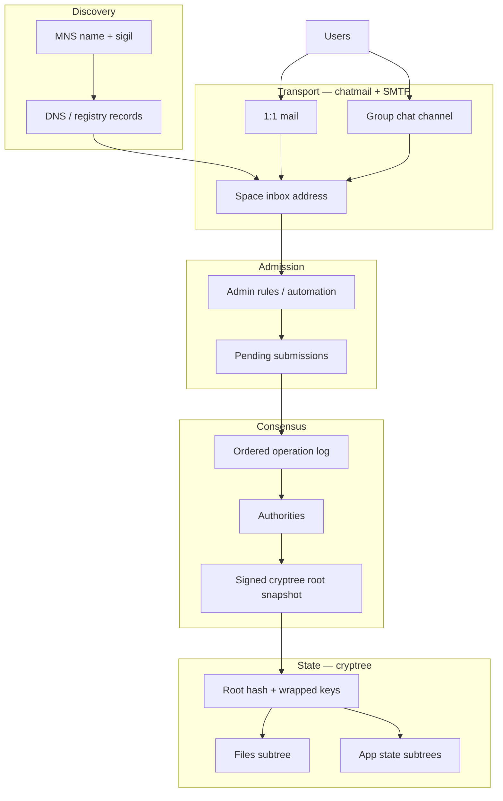

# Spaces architecture

A **Space** is a named, encrypted shared environment whose **state** is a cryptree (files + structured app data) and whose **history** is an authority-ordered operation log.

**Chatmail and email** deliver signed submissions to the space inbox. **Admission policy** decides what enters the log. **Authorities** sequence operations and publish signed cryptree root snapshots discoverable via **MNS**. Members read by snapshot; chat is the low-latency notification and submission UI — not the source of truth for drive state.

---

## Four layers

Earlier sketches used Governance → Consensus → (implicit transport). With chatmail/email integration, split into four layers:



| Layer | Job | Chatmail/email role |
|-------|-----|---------------------|
| **Discovery** | Who is this space? Who are authorities? Who are members? | MNS name → inbox address, authority pubkeys, policy; see [MNS_AND_SIGILS.md](./MNS_AND_SIGILS.md) |
| **Transport** | Deliver signed submissions; notify members | Group messages, 1:1 mail, classic SMTP to space address |
| **Admission** | Decide what becomes canonical | “Mailed in” ≠ committed until accepted |
| **Consensus** | Order ops, publish snapshots | Authorities sign root + seq |
| **State (cryptree)** | Encrypted tree of files + structured state | Content-addressed blocks; root hash is the commitment |

Chatmail is **not** the drive. It is how proposals, chat, notifications, and external publications **reach** the space.

---

## Cryptree (Peergos core, minus Peergos product)

We use the [mlkut/cryptree](https://github.com/mlkut/cryptree) implementation of the [Cryptree paper](https://github.com/Peergos/Peergos/blob/master/papers/wuala-cryptree.pdf) (with Peergos modifications). Peergos-specific social/login/IPNS layers are out of scope.

What cryptree provides:

1. **Merkle tree of encrypted nodes** — each node has a key; children are addressable by hash.
2. **Subtree revocation** — rotate a key → old ciphertext under that branch is dead.
3. **Single root hash** — compact commitment to entire tree state.
4. **Capability-style sharing** — grant `(location, key)` for a subtree without exposing siblings.

### Suggested subtree layout per space

| Subtree | Holds |
|---------|--------|
| `/files/...` | Drive: blobs + metadata |
| `/chat/...` | Optional: message index, pins, threads (or keep chat in mail only) |
| `/tasks/...` | Task board state |
| `/meta/...` | Space config, admission rules, schema versions |
| `/keys/...` | Member capabilities / epoch keys |

### Signed snapshot

Authorities publish something like:

```
(space_id, seq, timestamp, cryptree_root_hash, optional_wrapped_space_key_for_members)
```

Clients verify authority signatures, fetch blocks by hash from any store (authorities, WebDAV, IPFS, blossom-style blob hosts), decrypt with member capabilities.

**Root = fast read.** **Log = audit / catch-up / conflict repair.**

---

## Inbox pipeline

### Space has an address

Each space resolves to e.g. `design-team@spaces.example` (chatmail), optionally accepting classic SMTP.

MNS / on-chain record points to DNS and policy — see [MNS_AND_SIGILS.md](./MNS_AND_SIGILS.md).

### Submissions arrive as mail

A **publication** is a **signed envelope**, not a direct tree write. Content type is carried in **mail headers** (see [TRANSPORT_AND_PAYLOADS.md](./TRANSPORT_AND_PAYLOADS.md)).

Sources:

- Member posts in the **group chat** → engine wraps as internal submission
- External sender mails the **space address** → SMTP ingress
- Automation webhooks → same envelope format

### Admission gate

Until accepted, submissions live in **pending**, not in the canonical log:

| Space type | Typical admission |
|------------|-------------------|
| Personal / 1-user | Auto-accept from self |
| Private group | Auto-accept from members |
| Team | Members auto; externals need mod |
| Public community | Most inbound queued; mods or rules accept |

Chatmail gives verification, encryption, and delivery. The space adds a state machine: `received → pending → accepted | rejected → applied`.

### Authorities commit

On accept, authorities:

1. Assign monotonic `seq`
2. Append to ordered log
3. Apply op to materialized cryptree
4. Publish signed snapshot

Members learn via group notification, pull from authority endpoint, or optional email digest.

**Invariant:** transport duplicates are fine; consensus dedupes by `(author, op_id)` or content hash.

---

## State machine

```
┌─────────────┐     signed mail/msg      ┌──────────┐
│  Transport  │ ───────────────────────► │ Pending  │
└─────────────┘                          └────┬─────┘
                                              │ admit
                                              ▼
┌─────────────┐     apply op           ┌──────────────┐
│  Cryptree   │ ◄───────────────────── │ Canonical log│
│  (material) │                        └──────┬───────┘
└──────┬──────┘                               │
       │ root_hash                             │ seq
       ▼                                       ▼
┌─────────────┐                        ┌──────────────┐
│ Blob store  │                        │ Signed snap  │
│ (content)   │                        │ (authorities)│
└─────────────┘                        └──────────────┘
```

### Client read path

1. Resolve space via MNS / sigil
2. Fetch latest signed snapshot from any authority
3. Download cryptree blocks → render Files / Tasks / etc.
4. Optionally replay log since snapshot for audit

### Client write path

1. Construct signed submission locally
2. Send via group message and/or mail to space inbox
3. UI shows “pending” until admission
4. On snapshot notification, refresh tree

---

## Authorities

### One authority (small private space)

- Inbox processor + cryptree writer colocated (owner device or small server)
- Chatmail group chat = live UX; cryptree = backing store
- Lowest friction for v1

### Many authorities (team / public)

- Any authority may accept writes for availability (“write succeeds if any reachable”)
- **Strong consistency** needs majority agreement on `seq` and `root_hash`
- Once majority attests snapshot N, older ops can be archived

Cryptree helps because conflict resolution reduces to **which signed root wins at seq** — not ad-hoc JSON diffing.

---

## What exists vs what remains

### Available via Chatmail today

- E2E group messaging, attachments, mailing lists / channels
- Offline sync, multi-device, verified contacts
- Groups as the natural transport shell for Spaces

### Still to specify and implement

1. **Space identity beyond engine chat id** — stable id, MNS binding, authority set
2. **Header conventions** — differentiate chat, task, article, video, file op, etc.
3. **Cryptree integration** — per-space encrypted tree + blob hosting
4. **Admission + applier** — pending queue, rules, snapshot publisher
5. **Member capability rotation** — on remove member, rotate subtree keys

Do **not** make the message log *be* the file tree. Use chat for human latency; use cryptree for durable shared state.

---

## Design choices (open)

### Group chat: canonical or view?

**Recommendation:** Mirror into `/chat/` for search/pinning if useful, but treat delivery as transport. Canonical order lives in the authority log. Avoid fighting Chatmail semantics (edits, reactions, new-member history gaps).

### Where do blobs live?

Cryptree nodes reference **content hashes**. Storage options:

- Authority WebDAV (simplest for teams)
- Chatmail blobs (small files)
- Separate blob CDN (ciphertext only)

Email attachments are fine for **ingress**; canonical storage should be **hash-addressed**.

### External SMTP senders

Powerful for public communities; spam-prone. Default: admission queue. Unsigned mail → moderator preview; only signed submissions commit.

### Key rotation on membership change

Remove member → rotate `/files` and `/app` keys from an epoch node → deliver new capabilities to remaining members (chatmail 1:1 or dedicated key-delivery messages).

---

## Phasing

| Phase | Scope |
|-------|--------|
| **0 (now)** | Space = DC group; files are chat attachments |
| **1** | Per-space cryptree + single authority; ops as signed messages in group |
| **2** | Space inbox address + admission queue; external mail → pending |
| **3** | MNS discovery + multi-authority snapshots |
| **4** | Public communities + inbox automation rules |

Phase 1 delivers “private drive for Spaces” without full Byzantine consensus.

---

## Open questions

1. **Single writer per space initially?** (Recommended — matches DC group admin mental model.)
2. **Ops in chat body vs dedicated MIME part?** Dedicated part keeps chat UI clean; headers still identify type.
3. **Authority as blob host, or only signs roots?**
4. **Public communities:** is the space inbox public, with all externals landing in pending?
